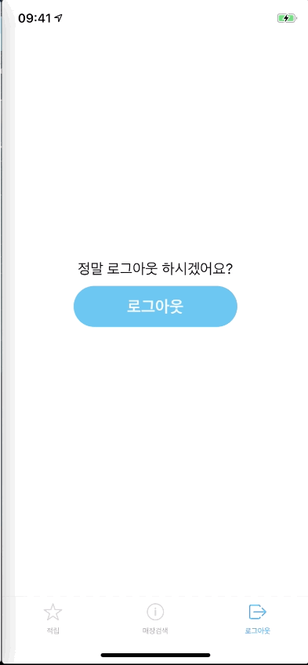

# 꾹꾹이

> 종이 쿠폰을 대체하는 간편한 전자 스탬프 플랫폼
- 꾹꾹이를 사용하는 모든 카페에서 쉽고 간편하게 스탬프를 **적립**하는 서비스
- 마시고 싶은 음료를 **검색**해 가까운 매장을 알려주는 위치 기반 서비스
- 적립한 스탬프를 친구에게 **선물**하는 스탬프 이체 금융 서비스

### App Client Repository

조금 더 선명한 시연 화면을 보고 싶으시다면 [이 곳](https://photos.app.goo.gl/Q2etwJZC3n54MwWL6)을 참고해 주세요.

### `가입 및 로그인`

신규 사용자(손님)가 앱에 가입 및 로그인 하는 기능입니다. 로그인에 성공했을때 서버로부터 토큰을 발급받으며, 토큰이 유효한 기간 동안은 앱을 켤 때 자동 로그인됩니다.

### `스탬프 적립 요청`

손님이 매장 안에서 앱을 켰다면, 가장 가까운 매장인 현재 매장이 자동 선택됩니다. 손님은 적립 버튼을 누르기만 하면 매장 사장님에게 적립 요청이 발송되며, 사장님이 한번의 클릭으로 스탬프 적립을 승인합니다.

### `교환권 획득 및 사용`

스탬프를 충분히 모았다면, 무료 음료를 받기 위한 교환권을 획득할 수 있습니다. 교환권을 사용할 때 매장 사장님에게 사용 요청을 발송하고, 사장님의 승인을 받아 교환권을 사용하게 됩니다. 교환권을 사용했으니 손님은 무료 음료를 제공받습니다.

### `다른 손님(앱 사용자)에게 스탬프 선물`

꾹꾹이 앱을 사용하는 다른 손님에게 스탬프를 선물하는 기능입니다. 대상의 연락처를 입력하고, 바르게 입력했다면 사용자의 이름과 보낼 스탬프 개수를 확인합니다.

### `다른 손님(앱 미사용자)에게 스탬프 선물`

꾹꾹이 앱을 사용하지 않아도 매장에서 손님 등록을 했다면 스탬프를 선물받을 수 있습니다. 매장 관리자가 신규 손님의 연락처를 입력받아 손님을 꾹꾹이 DB에 등록할 수 있고, 몇 번의 클릭을 더 해서 스탬프 적립도 가능합니다. 앱 사용자는 그 손님의 연락처로 검색하여 스탬프를 선물할 수 있습니다.

### `음료 기반 매장 검색과 정렬, 필터 기능`

'리스트레토'를 파는 근처 매장을 찾고싶다면? 꾹꾹이 앱에서 원하는 음료로 매장을 찾을 수 있습니다. 검색어를 입력하면 내 주변에 해당 메뉴를 판매하는 꾹꾹이 앱 가맹점이 검색됩니다. 현재 영업중인 매장이나 내가 교환권을 갖고있는 매장만 골라 볼 수 있고, 거리 / 내가 적립한 스탬프 개수 / 검색한 메뉴의 가격 순으로 검색 결과를 정렬할 수 있습니다.

### `매장 상세 정보 조회`

검색한 매장의 상세 정보를 조회하는 기능입니다. 스탬프 정보와 더불어 매장의 사진 / 주소 / 영업 시간 / 전화번호 / 메뉴 및 가격 / 지도를 보여줍니다.

### `로그아웃`

로그아웃 기능입니다.